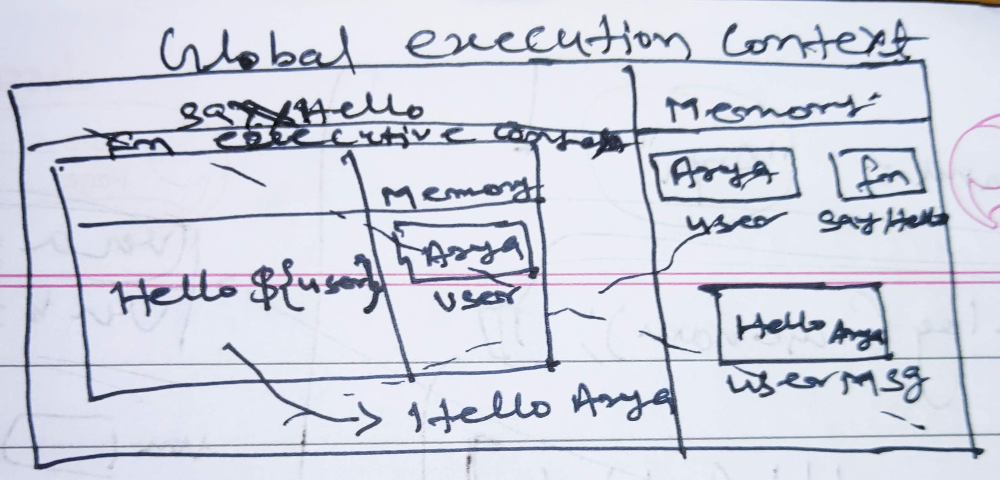
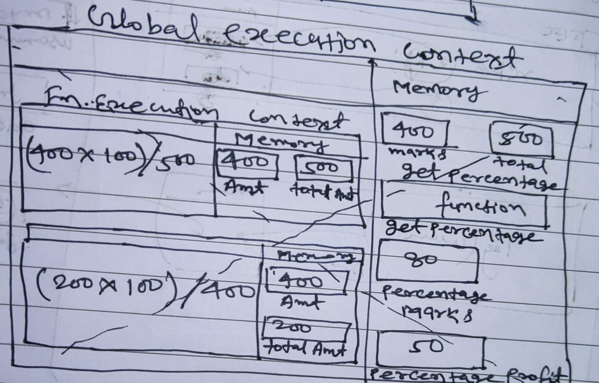
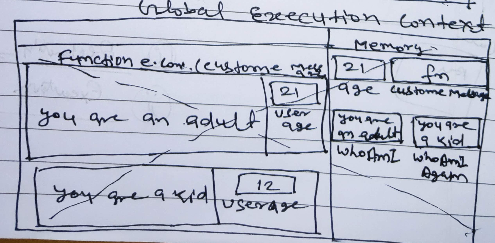

1. What does thread of execution means in JavaScript?

   When JavaScript executes a code line by line in JavaScript Engine is known as thread of execution.

2. Where the JavaScript code gets executed?

JavaScript code executed in the Global Execution Context in JavaScript Engine.

3. What does context means in Global Execution Context?
 
   Context is the environment in which we are executing the code.

4. When do you create a global execution context.

   Global execution context gets created by JavaScript Engine when it is running our code for the first time.

5. Execution context consists of what all things?

   Execution context consists our code line by line in JavaScript Engine.

6. What are the different types of execution context?

   There are  two types of execution context -

    1.Global Execution Context and 2.function execution context 

7. When global and function execution context gets created?

   Global execution context gets created by JavaScript Engine when
   it is running our code for the first time and function execution
   context gets created when we are excuting any function.

8. Function execution gets created during function execution or while declaring a function.

   Function execution gets created during function execution.

9. Create a execution context diagram of the following code on your notebook. Take a screenshot/photo and store it in the folder named `img`. Use `` to display it here.


```js
var user = "Arya";

function sayHello(){
  return `Hello ${user}`;
}

var userMsg = sayHello(user);
```

<!-- Put your image here -->




```js
var marks = 400;
var total = 500;

function getPercentage(amount, totalAmount){
  return (amount * 100) / totalAmount;
}

var percentageMarks = getPercentage(marks, total);
var percentageProfit = getPercentage(400, 200);
```

<!-- Put your image here -->




```js
var age = 21;

function customeMessage(userAge){
  if(userAge > 18){
    return `You are an adult`;
  }else {
    return `You are a kid`;
  }
}

var whoAmI = customeMessage(age);
var whoAmIAgain = customeMessage(12);
```

<!-- Put your image here -->

