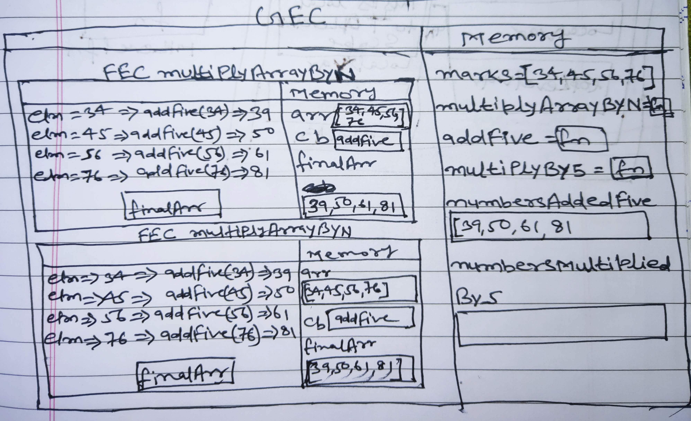

1. Which all function is Higher order function and which one is a callback function in the code given below.

```js
let marks = [34, 45, 56, 76];
function multiplyArrayByN(arr, cb) {  // HOF
  let finalArr = [];
  for (let elm of arr) {
    finalArr.push(cb(elm));
  }
  return finalArr;
}
function addFive(n) {  //callback function 
  return n + 5;
}
function multiplyBy5(n) {   //callback function 
  return n * 5;
}
let numbersAddedFive = multiplyArrayByN(marks, addFive);
let numbersMultipliedBy5 = multiplyArrayByN(marks, multiplyBy5);

// HOF multiplyArrayByN and callback function is addFive and multiplyBy5  
```


2. Create the execution context diagram of the above code snippet



3. Write a higher order function that accepts a number and a operation function (callback function). Call the callback function passing the number as argument and return the returned value.

```js
function operation(n, opFn) {
  return opFn(n);
}
// TEST
console.log(
  operation(21, function (n) {
    return n / 10;
  })
);
// Output: 2.1
console.log(
  operation(10, function (n) {
    return (n * n) / 5;
  })
);
// Output: 20
```

4. Write a higher order function that accepts a string and a operation function (callback function). Call the callback function passing the string as argument and return the returned value.

```js
function operation(str, opFn) {
  return opFn(str);
}
// TEST
console.log(
  operation("Learning to fly", function (text) {
    return text.toUpperCase();
  })
);
// Output: "LEARNING TO FLY"
console.log(
  operation("Higher Order Fucntion", function (text) {
    return text.split(" ");
  })
);
// Output: ["Higher","Order","Function"]
```
